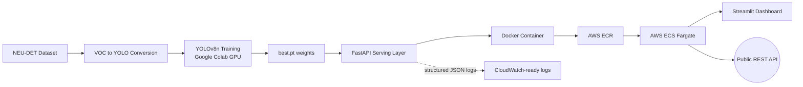

# Real-Time Manufacturing Defect Inspection System

An end-to-end computer vision system that detects surface defects (scratches,
cracks, inclusions) on manufactured steel parts, served via a production-style
REST API and deployed live on AWS. Built to demonstrate the full ML lifecycle
a Forward Deployed Engineer owns: problem framing, data pipeline, model
training, deployment, and a client-facing demo — not just a notebook model.

## Live Demo

- **API**: deployed on AWS ECS Fargate (scaled to zero by default to avoid
  idle cost — spin up with `aws ecs update-service --desired-count 1`)
- **Dashboard**: `streamlit run app/streamlit_app.py`, point it at the live API URL

## Architecture



## Results

| Metric                  | Value                              |
| ----------------------- | ---------------------------------- |
| mAP50 (overall)         | 0.737                              |
| Precision / Recall      | 0.699 / 0.674                      |
| Inference latency (CPU) | ~90ms mean (target: <200ms) - PASS |

Per-class recall varies significantly (`patches`/`scratches` ~90%,
`crazing`/`rolled-in_scale` ~35-55%) — see Known Limitations in
docs/design_doc.md for why, and what would fix it.

## Tech Stack

Python · YOLOv8 (Ultralytics) · PyTorch · FastAPI · Docker · AWS (ECR, ECS Fargate) ·
Streamlit · GitHub Actions (CI) · pytest

## Quickstart

```bash
python -m venv venv && source venv/bin/activate  # or venv\Scripts\activate on Windows
pip install torch torchvision --index-url https://download.pytorch.org/whl/cpu
pip install -r requirements.txt

# Run the API
uvicorn src.serving.app:app --port 8000
# -> http://localhost:8000/docs

# Run the demo dashboard (separate terminal)
streamlit run app/streamlit_app.py

# Run tests
pytest tests/ -v

# Build and run in Docker
docker build -f deployment/Dockerfile -t defect-inspection .
docker run -p 8000:8000 defect-inspection
```

## Project structure

├── docs/design_doc.md # problem framing, tradeoffs, known limitations
├── data/ # raw + processed dataset (gitignored, see docs)
├── src/
│ ├── data/ # VOC->YOLO conversion, exploration
│ ├── training/ # transfer-learning training script (MLflow tracked)
│ ├── evaluation/ # latency benchmarking
│ └── serving/ # FastAPI app (inference, logging)
├── app/streamlit_app.py # client-facing demo dashboard
├── deployment/Dockerfile # containerization
├── tests/ # pytest suite (runs in CI)
└── .github/workflows/ci.yml # automated test + Docker build on every push
